# FreeBSD Deduplicating Filesystem

### John Abendroth, Austin Seyboldt, Ryan Tucker

## Overview

We put together a FFS-like hierarchical indexed file system which deduplicates all data at the data block level. We accomplished this through our design of a layered filesystem. The filesystem is one module, but there is a notion of an upper layer and a lower layer. Much like UFS, the upper layer implements the hierarchical filesystem, files, and directories. The lower layer is our key-value store for data hashes and values, which deals exclusively in data blocks. Overall, the kvs lower layer can be thought of as a storage layer for the upper layer to interact with.

---

## On-disk layout

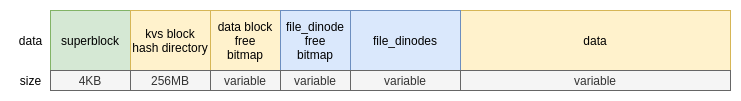

### KVS Block Hash table

This is a 256MB hash table containing 2<sup>16</sup> kvs_inode blocks\*. The hash table is a static size of 256MB regardless of disk size. Once kvs_inodes run out, we begin allocating them dynamically. It tracks inodes for our kvs layer.

### Free-block bitmap

This bitmap indicates which data blocks are free and which are inuse. The size of this bitmap depends on the partition size.

### File_dinode free bitmap

This bitmap tracks which inodes are free and inuse.

### File_dinodes

This segment contains space reserved for our inodes. Like ffs, we reserve this space for inodes, but only preallocate 256 inodes to begin with and then allocate additional inodes dynamically as needed. We do this not to save space for data, but to make disk creation time quicker. Space reserved for inodes cannot be reclaimed by the data segment. We reserve 8% of disk for inodes.

### Data

The amount of available data blocks is limited by partition size and filesystem overhead.

---

## Upper Layer - Lower Layer Interaction

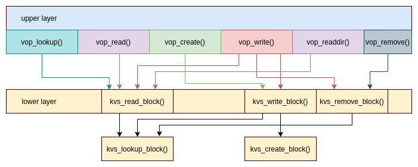

### Description

Our filesystem has an upper layer and a lower layer. The upper layer implements directories and files. The lower layer (kvs layer) is just a storage layer. In the kvs layer, everything is deduplicated. The data can be file data, directories, indirect blocks, etc. It is all deduplicated.

### Communication

We wanted a simple api for the top layer to use, so the top layer only ever calls read, write, and remove. The lower layer handles the logic for deciding whether a new data block actually needs to be created or removed by tracking the reference counts of the blocks, but this unknown to the upper layer. This simple design enable us to reuse ffs code easily by mostly just replacing their calls to bwrite() and bread().

---

## Upper Layer (File layer)

Our upper layer uses a lot of code from FFS. In many cases, their code is more complex and does a lot more then we needed, so we cut out much of their code. This includes code dealing with permissions, soft updates, and other macros and situations (like doing different things for the old version of ffs directories). We only use the core logic that we need.

### Directories

We will use directories as they are in ffs. We will make the root directory inode 1 like in ffs for consistency. We do not want to modify the directory structures because we want to be able to reuse as much ffs code as possible. We reuse the overall structure of their code, including the way they put entries into directories and do compaction. One notable thing that changed was directory chunks. We chose not to use the 512B chunks that ffs used because we allocate all blocks as 4KB and we wanted to simplify our implementation. Consequently, we do not get atomic directory updates and our entries are not aligned to sectors.

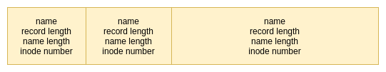

#### Reading a directory

We use ufs_readdir with modifications. We only need to modify the way they do offsets into the buf structs because they have buffers associated with their vnodes, so the offsets are different than ours which are always associated with the underlying disk device and are always 4KB in size (different from ffs).

#### Looking up a file in a directory

We borrow ffs's lookup function, with some modifications. The first thing we do is remove any code within ifdef statements, as well as permissions. The main difference is accessing the data on disk. Instead of accessing data the way they do, we instead grab the hash from the inode of the directory and call our lower-level _kvs_read()_ to read in the file, which is returned in a buf struct. Other than that, we only need to replace some of their macros for accessing struct fields with our own.

#### Entering an entry into a directory

We reuse ffs's direnter function to put new entries into a directory. We keep most of the logic the same, including the caching ffs uses between lookup and mkdir / create. We needed to see where they were accessing the files on disk and replace it with our own logic for accessing the data through the kvs layer, but all of the directory searching and insertion is the same as ffs.

#### Making a new directory

We were able to reuse most of ufs_mkdir after cutting out all of the unnecessary code pertaining to soft updates. We set up a directory the same way (setting up the "." and ".." fields). We needed to change all of their inode and disk access stuff to our way of doing it.

### File Inodes

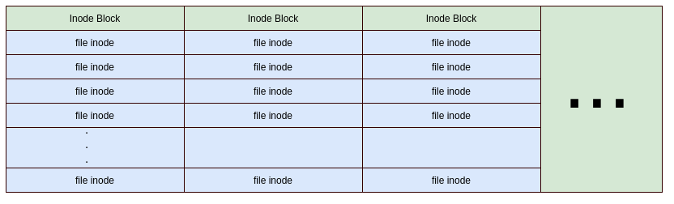
File inodes are almost the same as ffs, but we have modified the direct and indirect pointers to instead use our kvs_key struct. We reserve 8% of disk space for file inodes, although only a small amount are allocated up-front. 2048 inodes are allocated statically at fs creation time. Further inodes will be allocated as needed. Free and in-use inodes are tracked by our inode bitmap. Inodes are allocated in 4KB blocks of 16 inodes each. We decided to allocate them dynamically to speed up the build time of our filesystem.

#### Finding a free inode

We attempt to allocate indoes from inode blocks in a roughly linear fashion, using up first inode blocks before later ones. We find a free inode in the following way:

- Find the block number of the inode block which most recently began being used (stored in superblock)
- Look at the bitmap for the block to see if there is free space
- if free space, flip a bit and return the inode number
- otherwise if the next inode block has already been allocated, try to allocate from there
- else if at the most recently allocated inode:
  - if the ratio of used:total allocated inodes > 80%, allocate a new block and pick from there
  - otherwise, begin searching for space in the previously allocated blocks

#### Dynamic allocation of inodes

To dynamically allocate a new block of inodes, we simply increment the count of total allocated inode blocks. The disk space is already reserved for us, so we just need to zero out the block. Inodes are not managed by the kvs layer.

### Files

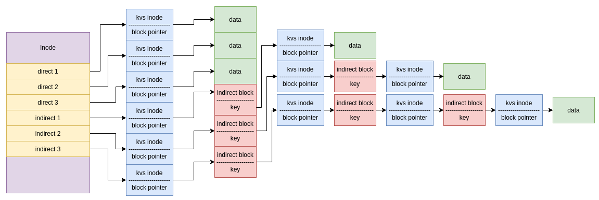
Files are implemented through the use of direct and indirect block pointers in our inodes. The block pointers hold hash keys that point to a kvs_inode in the kvs layer, which has the actual data. The first 3 block pointers point directly to these inodes. The indirect pointers point to indirect blocks which are stored in the kvs layer, those blocks in turn have keys which point to other kvs inodes with the actual file data.

#### Indexing into files

We can read and write offsets into files by dividing the offset by the blocksize (4KB) and then using this new offset to find the key in the inode. We perform divison and modulo operations to find out which indirect block the key belongs to.

---

## Lower Layer (KVS / block layer)

### KVS Indexing -- Functionality and Data Structures

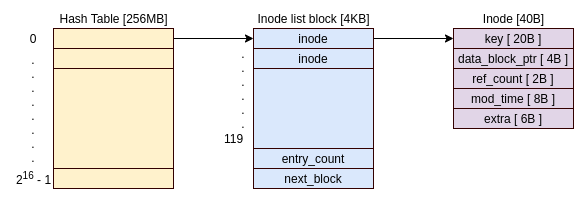

### Overview

A key-lookup proceeds as follows:

- A hash key is provided by the upper layer of our fs
- This value indexes into an inode block in the inode block hash table
- The inode block is scanned linearly from beginning to end, possibly following a link to another block
- The search stops when the key is found or the end of the linked list is encountered

### Inode block hash table

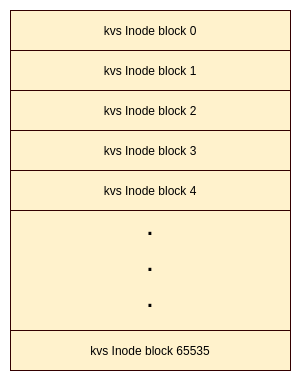  
This is a hash table which maps 40 hex keys to any one of 2<sup>16</sup> _inode block_ linked lists. We wanted a hash table to provide fast lookup of values, but a table large enough to store one directory entry per bucket was unrealistic. So we opted to keep the hash moderately sized and use linked lists of inode blocks to store our key-inode mappings. We didn't want to use multiple levels of indirection for the table because we wanted efficient use of space for key storage  
The decision was made to keep the hash table reasonably small for two reasons:

- We wanted to limit disk usage of the table
- We wanted the table small enough to ensure that collisions happen frequently enough to fill our linked lists and thus use disk space efficiently.

The implications of the hash table size is that lookups and insertions will be reasonably fast and approximately constant (of course, linear scan of <= 102 slots) for up to 6.7 million keys, at which point performance will begin to degrade. This can be seen by the following:

- 2<sup>16</sup> inode blocks
- 102 key-inode pairs per inode block
- 2<sup>16</sup> \* 102 = ~ 6.7 million keys

### KVS_Inode block

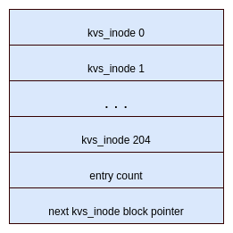  
An inode block contains 102 40-byte key-inode mappings. The end of the directory also contains a 2 byte count of the size and a 4 byte block number for the next directory entry block in the list.  
To lookup a key in the directory entry, a linear search is performed beginning at the start of the block and continuing until the key is found or the end of the list is encountered.

- key: the 20 byte hex key
- count: counts how many keys are in directory so we can possible free empty blocks (may not want to though since its likely it'll be used again soon)
- next block number: address of next block in linked list

### KVS_Inode

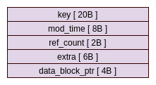  
An inode is 40 bytes and contains a data block number, a reference count, and a modification time. Inodes are allocated statically in the inode hash table but if more are necessary, they will be allocated from the data section of disk.

### Free-block bitmap

Free and used blocks will be tracked by a bitmap. We do not optimize block placment for data locality because we assume that our filesystem will be receiving data that is good for deduplicating. If this is the case, then true locality will not be possible because many files will hold many different blocks throught the system. Thus, we use a pseudo-random number to select a random 4KB bitmap block and then perform a linear search within the block to select the first available data block. This method was selected for ease of implementation but a better long-term solution would be to select random bits within the 4KB block as well, since a linear search would become slow as more blocks are allocated.

### Allocating kvs_inode list blocks

- Statically allocated (6.7 million)
- dynamically allocated in data segement as needed

### KVS Caching (unimplemented)

We will implement a simple name cache in our kvs layer to keep track of which hash keys exist. The plan is to create a fixed size table, say 80KB, which will hold hash keys. We can fit 204 keys per block so 80KB will hold 4096 keys. The cache will be searched in kvs_lookup and updated in kvs_create and kvs_remove. It will be indexed into by performing a modulo operation on the key to find the index. Although it only stores 4096 keys, they will be evenly distributed so we should get good usage of the table. The goal is to make lookups faster so we can skip reading in an inode block from disk.

---

## Performance

Our filesystem is not particularly fast. We improved performance a bit by transitioning to asynchronous writes where possible, but the amount of disk accesses that need to happen definitely slow us down. Some ways we could improve performance include grouping superblock updates, inode updates, and bitmap updates together and writing them at once. This could be accomplished by holding them in memory and writing them later in batches. We did not want to deal with this amount of complexity in our assignment though and our design was much simpler and easier to follow because of it.

---

## Citations

Citations include msdos filesystem and Berkeley FFS. Much of the vfs_ops was taken from msdofs, while much of the vnode ops were taken from FFS. Specific citations can be found within the sourcecode.

---

## Data Structures

### General

#### Mount Structure

```
struct ddfs_mount {
    struct mount* mountp;                            // ptr to the mount struct
    struct kvs_sblock superblock;                    // our in-memory superblock
    uint64_t hash_bitmap[HASH_BITMAP_ARRAY_SIZE];    // tracks which hash entries have >= 1 key
    struct g_consumer* consumer_geom;                // our fs geom
    struct vnode* devvp;                             // vnode for char device mounted
    struct cdev* dev;                                // character device
};
```

#### Superblock

```
struct kvs_sblock {
    uint32_t superblock_size;        // size in blocks (always 1 block)
    uint32_t total_data_blocks;      // number of usable data blocks
    uint32_t data_block_offset;      // block number of beginning of data blocks
    uint32_t kvs_inode_table_offset; // block number of beginning of inode table
    uint32_t kvs_inode_table_size;   // hash table size expressed as a count of entries
    uint32_t hash_bitmap_offset;     // offset of hash bitmap (track used entries)
    uint32_t free_bitmap_offset;     // block number of beginning of free bitmap
    uint64_t fs_uid;                 // system wide uid for our fs
    uint16_t block_size;             // block size in bytes
	uint32_t file_inode_offset;		 // disk offset where inodes are
	uint32_t max_file_inodes;		 // maximum number of file inodes
	uint32_t last_used_finode_blk;	 // max used inode block number
	uint32_t uint32_t last_alloc_finode_blk;	// location of last allocated file inode block

    u_char fs_name[MAXMNTLEN];       // path name of our fs
    u_char fs_volname[MAXVOLLEN];    // volume name of our fs

	int32_t fs_magic;                // magic number identifies our fs

    // Summary info for os
    uint32_t used_data_blocks;
    uint32_t used_file_inodes;
	uint32_t used_kvs_inodes;
    uint8_t padding[3544];
};
```

#### KVS keys

```
typedef struct kvs_key {
	char[20];
} kvs_key
```

### Upper layer (file layer)

#### On-disk inode

This inode is taken from ffs and altered to meet our needs. Specifically, we changed the direct and indirect pointers to use our kvs_key struct instead of ffs's block addresses. There are 2048 inodes allocated by default in our filesystem, which span across 128 4KB blocks. Each block of inodes holds 16 inodes.

```
struct file_dinode {
	u_int16_t	di_mode;	/*   0: IFMT, permissions; see below. */
	int16_t		di_nlink;	/*   2: File link count. */
	u_int32_t	di_uid;		/*   4: File owner. */
	u_int32_t	di_gid;		/*   8: File group. */
	u_int32_t	di_blksize;	/*  12: Inode blocksize. */
	u_int64_t	di_size;	/*  16: File byte count. */
	u_int64_t	di_blocks;	/*  24: Blocks actually held. */
	ufs_time_t	di_atime;	/*  32: Last access time. */
	ufs_time_t	di_mtime;	/*  40: Last modified time. */
	ufs_time_t	di_ctime;	/*  48: Last inode change time. */
	ufs_time_t	di_birthtime;	/*  56: Inode creation time. */
	int32_t		di_mtimensec;	/*  64: Last modified time. */
	int32_t		di_atimensec;	/*  68: Last access time. */
	int32_t		di_ctimensec;	/*  72: Last inode change time. */
	int32_t		di_birthnsec;	/*  76: Inode creation time. */
	u_int32_t	di_gen;		/*  80: Generation number. */
	u_int32_t	di_kernflags;	/*  84: Kernel flags. */
	u_int32_t	di_flags;	/*  88: Status flags (chflags). */
	u_int32_t	di_extsize;	/*  92: External attributes size. */
	kvs_key		di_db[3]; /* 112: Direct disk blocks. */
	kvs_key		di_idb1;	// single indirect block pointer
	kvs_key		di_idb2;	// double indirect block pointer
	kvs_key		di_idb3;	// triple indirect block pointer
	u_int64_t	di_modrev;	/* 232: i_modrev for NFSv4 */
	uint32_t	di_freelink;	/* 240: SUJ: Next unlinked inode. */
	uint32_t	di_ckhash;	/* 244: if CK_INODE, its check-hash */
	uint32_t	di_spare[2];	/* 248: Reserved; currently unused */
}
```

#### In-memory inode

This is taken from ffs, with only the pointers to structs updated to our own. We did also remove some of their data that we did not need.

```
struct file_inode {
	struct vnode* i_vnode;         // pointer to the parent vnode
    struct ddfs_mount* mnt;        // pointer to the mount for our fs
    struct file_dinode* dinode;    // actual on-disk inode

    uint32_t i_number;    // the inode's number
    u_int32_t i_flag;     /* flags, see below */

    /*
     * Side effects; used during directory lookup.
     */
    int32_t i_count; /* Size of free slot in directory. */
    doff_t i_endoff; /* End of useful stuff in directory. */
    doff_t i_diroff; /* Offset in dir, where we found last entry. */
    doff_t i_offset; /* Offset of free space in directory. */

    /*
     * Copies from the on-disk dinode itself.
     */
    u_int64_t i_size;  /* File byte count. */
    u_int64_t i_gen;   /* Generation number. */
    u_int32_t i_flags; /* Status flags (chflags). */
    u_int32_t i_uid;   /* File owner. */
    u_int32_t i_gid;   /* File group. */
    u_int16_t i_mode;  /* IFMT, permissions; see below. */
    int16_t i_nlink;   /* File link count. */
}
```

### Lower Layer (Storage / block layer)

#### On-disk block inode

This inode is used by our lower-layer kvs to track blocks. This inode is the same from assignment 3.

```
struct kvs_dinode {
    struct kvs_key;    				// the 160 bit (40 hex char) key for a block
    uint32_t data_block;           // block number of the data relative to the
                                   // start of the data section
    uint64_t mod_time;             // last written time
    uint16_t ref_count;            // how many keys point to this block?
};
```

#### On-disk inode_list_block

This is what an entry in our hash table looks like. It is a block of inodes.

```
struct kvs_inode_list_block {
    struct kvs_dinode entries[INODE_PER_BLOCK_COUNT];    // list of inodes
    uint32_t next_block;                            // data block number of the next block
    uint16_t entry_count;                           // how many entries are currently in the block
    char padding[10];
};
```

#### In-memory inode

This structure is necessary to hold information about our inode. It has a pointer to an in-memory copy of our inode, as well as the location on disk that the inode was found so that way functions that use the inode will know where to update it on disk.

```
struct kvs_node {
    struct inode kvs_dinode;        // in-memory inode
    uint32_t inode_table_lblock;    // which logical block is the inode table located at
    uint32_t entry_index;           // which entry in the inode table is it
};
```

---

## VFS Ops

The vfs ops are essentially indentical to the vfs ops from assignment 3. We directly copied them and they needed no modifications.

---

## File layer (Upper layer)

### VOP_Lookup

This function is modeled on ffs's lookup algorithm. We are attempting to reuse much of their code since our directory structure is the same as theirs.

```
 * Overall outline of ufs_lookup:
 *
 *	search for name in directory, to found or notfound
 * notfound:
 *	if creating, return locked directory, leaving info on available slots
 *	else return error
 * found:
 *	if at end of path and deleting, return information to allow delete
 *	if at end of path and rewriting (RENAME and LOCKPARENT), lock target
 *	  inode and return info to allow rewrite
 *	if not at end, add name to cache; if at end and neither creating
 *	  nor deleting, add name to cache

vop_lookup(){

}
```

### VOP_Create

```
int vop_create () {
	if num_inodes == inode_blocks * INODES_PER_BLOCK:
		allocate_new_inode_block

	inode_num = find_free_inode()

	parent_inode = dvp->data
	while (!free_direntry_found)
		dir_block = read(parent_inode[current_key])
		loop through dir_block
			if free_space
				write ourselves back to dir_block
				break

	get_node(... , inode_num)

}
```

### VOP_Read

This function consists of a loop which continues to issue 4KB read requests to the kvs layer as long as there is more requested data and the end of file is not reached.  
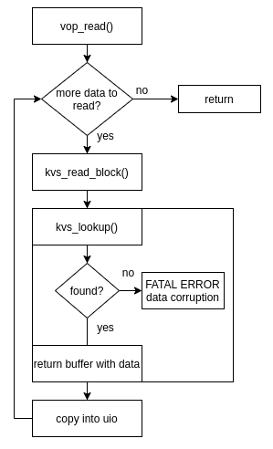

```
int vop_read () {
	struct kvs_key hash_key
	struct buf* bp

	while more data requested and not at EOF:
		hash_key = get next kvs_key from inode
		kvs_read_block (hash_key, bp)
		uiomove(uio, buf)
		brelse(bp)
}
```

### VOP_Write

As long as there is more uio data to be written, this function issues write requests to the kvs layer. First, it hashes the data block and then checks if the hash is different from the current hash for the block. If it is the same, continue; otherwise, issue a write request to the kvs layer. If successful, the old block needs to have its reference count decremented (if the old block exists). A remove request is issued to the kvs layer for the old block. This style writing only overwrite the file in place, it does not prepend or append to different sections of the file.
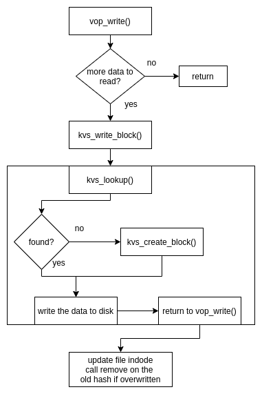

```
int vop_write () {

	while more data in uio to write:
		old_hash := get the hash of the block at the offset in the file for this write
		if the old hash is not null and offset in the file isn't 0 or the amount to write is less than a block:
			read in the block for the old_hash since the whole block isn't being overwritten and copy it to the block buffer
		else:
			just zero out the block buffer

		calculate how much to transfer from user space by taking either a full block, or the total amount left to transfer, whichever is smaller

		if the amount transfered from userspace so far + plus the amount transferring now is greater than the current file size:
			increase the file size since we're going to write past it

		copy uio data into block buffer at appropriate offset to overwite just the data specific part of the block

		new_hash = hash the block buffer buffer full of new data

		if new_hash == old_hash:
			continue since nothing new is written

		call kvs_write_block() to write the new hash and block buffer to disk

		if no error on write and old_hash is not null:
			call kvs_remove_block() on old hash since the block buffer has been written to a new spot on disk

		replace the old hash with the new hash in the file dinode block pointers, since we wrote the new hash to disk

	return 0 to show sucess
}
```

### VOP_Remove

Our remove has been mostly implemented, and works for removing files. The only thing uncompleted is updating the used inode bitmap.

```
int vop_remove() {
	decrement the reference count to the file's inode

	read in the directory entry for the file

	zero out the file directory entry so that it looks unused

	if the free slot size in the directory is 0:
		collapse the free space into the previous directory entry

	write the block for the directory entry back to disk

	remove the cached name entry for the directory that lookup() uses

	if the inode link count is 0:
		for each entry in the direct and indirect hash key pointers:
			call kvs_remove_block() on the hash

		nullify the dinode by setting all direct and indirect hash key keys to 0 and set the dinode block count and file size to 0

		write the dinode back to disk
	else:
		just write the dinode back to disk with the updated file reference count to it

	free the file inode used in the inode bitmap

	return 0
}
```

### VOP_Mkdir

```
vop_mkdir() {
	find and initialize a new inode / vnode
	mark it as a directory, set times, etc
	kvs_write_block(default directory)
	put kvs hash key in inode
	write inode to disk
	newdir = make a directory entry for new directory
	put newdir in parent dir
	write parent dir to disk
}
```

### VOP_readdir

```
vop_readdir() {
	while not at end of directory:
		get next entry and add it to the dirent struct passed to us
}
```

---

## KVS functions (lower layer)

### kvs_write_block

This function writes a 4KB block to disk. It must first do a lookup to see if the block with the given hash exists. If it does, the disk location is returned, the block is read, its reference count is incremented and it is written back to disk. Otherwise, we must call kvs_create_block to write a new block to disk.

Arguments:

- block_buf: 4KB char array containing the data to write
- hash_key: kvs_key struct containing the block hash

```
int kvs_write_block (block_buf, hash_key) {

	if no data to write is given:
        return

	kvs_lookup_block(hash_key)

	if the block from hash_key was found:
		read the block into a buffer cache buffer
		increment its reference count
	else:
		kvs_create_block(hash_key) to create a block with the given hash hash_key
		read whatever is currently stored at the block and zero it out
		set the ref count for this new block to 1

	copy the data to be written from block_buf to the buffer cache buffer

	write the new data to disk asynchronously

	return 0
}
```

### kvs_read_block

This function accepts a hash_key and reads the corresponding block if it exists and sets the pointer to `bpp` to the read in data. Otherwise, it returns error. In the case of an error, bp will be null on exit.

Arguments:

- hash_key: kvs_key struct
- bp: a double pointer to a buf struct

```
int kvs_read_block (hash_key, buf** bpp) {

	look up the block with given hash_key with kvs_lookup_block() to see if it exists

	if a block is found:
		location to read = returned kvs_node data block location + the super block data block offset
	else:
		the lookup failed so the block doesn't exist to read, return error

	read the disk location into a buffer

	set *bpp equal to the buffer read into for caller to access

	return 0
}
```

### kvs_create_block

This function finds a free block, allocates a block inode for it, and sets the disk_location to contain the location of the data block. It does not actually touch the data block. This means the caller is reponsible for zeroing out the block.

Arguments:

- hash_key: kvs_key struct for the desired inode
- node: a double pointer to the in-memory node for the newly allocated inode

```
int kvs_create_block (kvs_key hash_key, kvs_node** node) {
	find_free_block()
	create new_dinode, set the key and data block number
	get_free_inode_entry(... , buf)
	memcpy our new dinode into the inode_block
	write back to disk
	set *node = new_dinode
}
```

### kvs_lookup_block

This function performs a search on disk for the inode corresponding to the hash*key. \_First, looks in our cache for it* If found, it returns 0 and allocates an in-memory kvs*node, which is returned in the input argument. \_Also puts the node in our cache...??*

Arguments:

- hash_key: kvs_key struct
- node: a double pointer to a kvs_node which contains the in memory inode and its on-disk location

```
kvs_lookup_block (hash_key, kvs_node** node) {

	// possibly perform a cache lookup for the key first
	// (future optimization plan)

	let idx = hash_key % 2^16
        - the idx is the block in our inode table
    inode_lblock = inode_table_offset + idx

    do:
        inode_dblock = convert inode_lblock to dblock
        do bread(bp) on the dblock to get the inode block

		set next_inode_lblock_no = the inode block next block pointer

        for each inode in inode_block:
            if it's data_block == 0: // (it's not valid)
                continue

            if the inode's key matches our key:
                new_inode = malloc an inode
                memcpy the inode from bp into new_inode
                break

        inode_lblock_no = next_inode_lblock_no + super block data block offset

    } while (not at end of block list and key not found)

    if the key wasn't found:
        goto not_found

	new_node = malloc a kvs_node, copy our inode into it,
			   save location data for the inode
	*node = new_node for caller to access

    // place the found inode into our in-memory inode cache in future

    return 0

not_found:
	set *node = NULL so caller knows the lookup failed
}
```

### kvs_remove_block

This function removes a reference to a given datablock associated with a hash key. Then, if the reference count is now 0 it marks the datablock as free so it can be reused.

Arguments:

- hash_key: a kvs_key struct with the hash to lookup and remove a reference to

```
kvs_remove_block(hash_key) {
	call kvs_lookup_block() on the hash key

	if the returned kvs_node is NULL:
		no datablocks associated with the hash_key, return error

	decrement the reference count with the inode of the data block

	if the ref count is 0:
		invalidate the inode block entry by setting its data block number equal to 0
		decrement the inode block entry count

	write the updated inode back to disk

	if the inode ref count is 0:
		update the bitmap to reflect the datablock is now free
		update the superblock to reflect 1 less entry

	return 0
}
```
